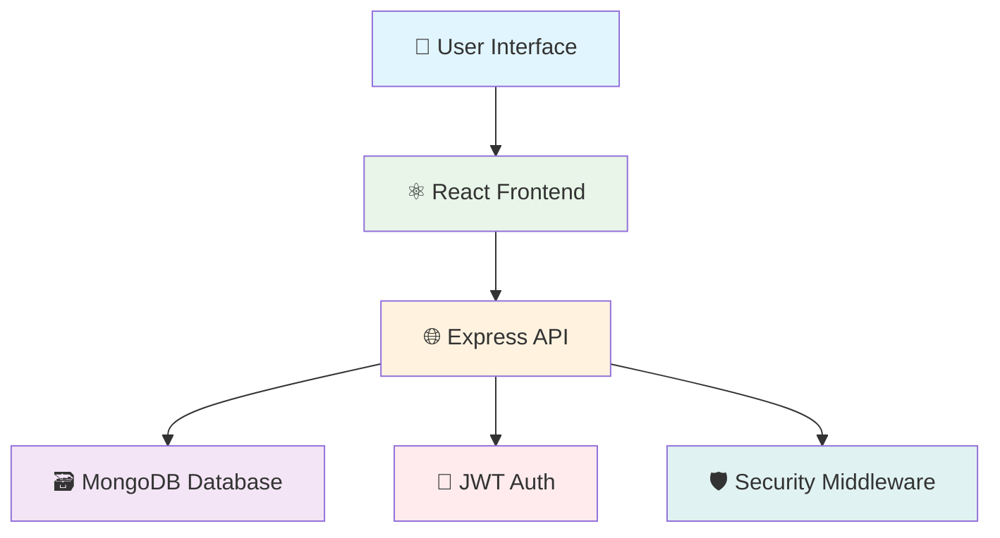
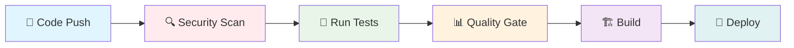

<div align="center">

# 💰 PayFlow - Secure International Payment Portal


[](https://github.com/ST10255814/insy7314-final-poe)
[](https://sonarcloud.io/project/overview?id=insy7314-final-poe)
[](https://github.com/ST10255814/insy7314-final-poe)
[](https://nodejs.org/)
[](LICENSE)

**🏛️ Academic Project** | **🎓 INSY7314** | **🔒 Enterprise Security** | **⚡ MERN Stack**

</div>

---

## 🎯 **Project Overview**

<div align="center">

### 🌟 **Enterprise-Grade Secure Payment Solution**

</div>

> **PayFlow** is a comprehensive secure payment portal designed for international transactions with enterprise-grade security features. This project demonstrates advanced cybersecurity principles including secure authentication, input validation, CSRF protection, and comprehensive security testing.

<div align="center">

### 📊 **Tech Stack**


</div>

---

## 👥 **Meet The Team**

<div align="center">

| 👨‍💻 **Developer** |
|:---:|:---:|:---:|
| **Jayden Larkins** |
| **Gerhard Lemmer** |
| **Thatho Mokoena** |
| **Mokran Ait Amara** |

**📅 Project Timeline:** November 2025
**🏫 Institution:** Varsity College (ADvTECH Group)

</div>

---

## ✨ **Key Features & Highlights**

<table>
<tr>
<td width="50%">

### 🔐 **Security First**
- ✅ Multi-layer authentication
- ✅ CSRF & XSS protection
- ✅ Rate limiting & monitoring
- ✅ HTTPS enforcement
- ✅ JWT with HTTP-only cookies

</td>
<td width="50%">

### ⚡ **Performance & Quality**
- ✅ SonarCloud integration
- ✅ Automated CI/CD pipeline
- ✅ Real-time monitoring

</td>
</tr>
</table>

<div align="center">

### 🌍 **International Payment Processing** | 💳 **Multi-Currency Support** | 📊 **Real-time Analytics**

</div>

---

## 🏗️ **System Architecture**

<div align="center">

### 🔄 **MERN Stack Architecture Flow**



</div>

<table>
<tr>
<td width="50%">

### 🔧 **Backend Structure**
```
backend/
├── 🔐 auth/           # Authentication & middleware
├── 🎮 controller/     # API route controllers
├── 🛡️ middleware/     # Security layers
├── ⚙️ service/        # Business logic
├── 🗄️ database/       # MongoDB config
├── 🔧 utils/          # Validation utilities
├── 🧪 tests/          # Comprehensive testing
└── 🚀 server.js       # Application entry
```

</td>
<td width="50%">

### ⚛️ **Frontend Structure**
```
frontend/
├── 📱 src/
│   ├── 🧩 components/    # React components
│   ├── 📚 lib/          # Axios configuration
│   ├── 🔧 utils/        # Helper utilities
│   └── 🎯 App.jsx       # Main application
├── 🌍 public/           # Static assets
└── 📦 package.json      # Dependencies
```

</td>
</tr>
</table>

---

## 🔒 **Enterprise Security Framework**

<div align="center">

### 🛡️ **Multi-Layer Security Architecture**


</div>

<table>
<tr>
<td width="50%">

### 🔐 **Authentication & Authorization**
- 🎫 **JWT Tokens** with HTTP-Only cookies
- 👥 **Role-based Access** (Employee vs Customer)
- 🔄 **Session Management** with secure settings
- 🔒 **Password Hashing** using bcrypt (12 rounds)
- ⏰ **Token Expiration** & refresh mechanisms

</td>
<td width="50%">

### 🛡️ **Input Security**
- ✅ **RegEx Whitelist** validation for all inputs
- 🚫 **XSS Protection** with input sanitization
- 💉 **SQL Injection Prevention**
- 📝 **Zod Schema** validation on frontend
- 🔍 **Data Validation** at multiple layers

</td>
</tr>
<tr>
<td width="50%">

### 🌐 **Network Security**
- 🛡️ **CSRF Protection** with token validation
- ⏱️ **Rate Limiting** (15 requests/15 minutes)
- 🌍 **CORS Configuration** with whitelist
- 🪖 **Helmet.js** security headers
- 🔐 **HTTPS Enforcement** with SSL certificates

</td>
<td width="50%">

### 🏗️ **Infrastructure Security**
- 📋 **Content Security Policy** (CSP)
- 🔒 **Strict Transport Security** (HSTS)
- 🔧 **Security Headers** configuration
- 🌿 **Environment Variables** protection
- 🔄 **Secure Cookie** settings

</td>
</tr>
</table>

<div align="center">

### 🎯 **Security Standards Compliance**


</div>

---

## 📡 **API Documentation**

<div align="center">

### 🔌 **RESTful API Endpoints**


</div>

<table>
<tr>
<td width="33%">

### 🔐 **Authentication**
```http
POST /auth/register
POST /auth/login
POST /auth/logout
GET  /auth/verify
```

</td>
<td width="33%">

### 💳 **Payment Management**
```http
GET  /api/payments
POST /api/payments
GET  /api/payments/:id
PUT  /api/payments/:id
```

</td>
<td width="33%">

### 👨‍💼 **Employee Portal**
```http
GET /api/employee/payments
PUT /api/employee/payments/:id/verify
GET /api/employee/dashboard
```

</td>
</tr>
</table>

---

## 🚀 **Quick Start Guide**

<div align="center">

### ⚡ **Get Started in 5 Minutes**


</div>

### 📋 **Prerequisites**

<div align="center">


</div>

### 🔧 **Installation Steps**

#### **Step 1: Clone Repository**
```bash
git clone https://github.com/ST10255814/insy7314-final-poe.git
cd insy7314-final-poe
```

#### **Step 2: Backend Setup**
```bash
cd backend
npm install
# Configure your .env file
cp .env.example .env
```

#### **Step 3: Frontend Setup**
```bash
cd ../frontend
npm install
```

#### **Step 4: Launch Application**

<table>
<tr>
<td width="50%">

**🔧 Backend Server**
```bash
cd backend
npm run dev
```
🌐 **API**: `https://localhost:5000`

</td>
<td width="50%">

**⚛️ Frontend Application**
```bash
cd frontend  
npm start
```
🖥️ **Web App**: `https://localhost:3000`

</td>
</tr>
</table>

<div align="center">

### 🎉 **You're Ready to Go!**

**🔐 Default Employee Login:**
- **Username:** `bank_employee`
- **Password:** `Employee@123`

</div>

### 🌐 **Browser Setup for Development**
<details>
<summary>Click to expand browser configuration for self-signed certificates</summary>

**Windows:**
```bash
chrome.exe --ignore-certificate-errors --user-data-dir="C:/temp/chrome_dev" --disable-web-security
```

**macOS:**
```bash
open -a "Google Chrome" --args --ignore-certificate-errors --user-data-dir="/tmp/chrome_dev" --disable-web-security
```
</details>

---

## 🧪 **Testing & Quality Assurance**

<div align="center">

### 📊 **Comprehensive Testing Suite**


</div>

<table>
<tr>
<td width="50%">

### 🔧 **Backend Testing**
```bash
cd backend
npm test                 # 🧪 Run all tests
npm run test:watch       # 👀 Watch mode
npm run test:ci          # 🔄 CI with coverage
npm run test:security    # 🛡️ Security tests
```

**📋 Test Coverage:**
- ✅ Unit Tests: Authentication, Controllers
- ✅ Integration Tests: API endpoints
- ✅ Security Tests: OWASP validations
- ✅ Performance Tests: Load testing

</td>
<td width="50%">

### 🔐 **Security Testing**
```bash
npm run security:audit   # 📊 NPM audit
npm run security:snyk    # 🔍 Snyk scan
npm run security:zap     # ⚡ OWASP ZAP
npm run lint:security    # 🛡️ ESLint rules
```

**🔍 Security Scans:**
- ✅ Dependency vulnerabilities
- ✅ Static code analysis
- ✅ Dynamic security testing
- ✅ Penetration testing automation

</td>
</tr>
</table>

---

## 🔄 **CI/CD Pipeline**

<div align="center">

### ⚙️ **Automated DevOps Workflow**


</div>

### 🚀 **Pipeline Stages**



<table>
<tr>
<td width="50%">

### 🔄 **Workflow 1: Comprehensive CI/CD**
- 🔐 **Security Scanning**: OWASP, Snyk
- 🧪 **Testing Suite**: Unit, Integration, E2E
- 🏗️ **Build Process**: Frontend & Backend
- 📊 **Quality Analysis**: SonarCloud integration
- 🚀 **Deployment**: Automated staging/production

</td>
<td width="50%">

### 🛡️ **Workflow 2: Security-First**
- 🔍 **SAST**: Static Application Security Testing
- 📦 **Dependency Check**: Automated vulnerability scanning
- 🔒 **License Compliance**: Legal compliance monitoring
- 📋 **Security Reports**: Comprehensive vulnerability reports

</td>
</tr>
</table>

### ✅ **Quality Gates**
- 🧪 **All tests must pass** (95%+ coverage required)
- 🔐 **Security approval** (no high/critical vulnerabilities)
- 📊 **Code quality metrics** meet standards
- 📋 **Documentation** up to date

---

## 🛠️ **Development Commands**

<div align="center">

### ⚡ **Quick Reference Guide**

</div>

<table>
<tr>
<td width="50%">

### 🔧 **Backend Commands**
```bash
npm start              # 🚀 Production server
npm run dev            # 🔧 Development mode
npm test               # 🧪 Run test suite
npm run lint           # 📝 Code linting
npm run lint:fix       # 🔧 Auto-fix issues
npm run security:audit # 🔐 Security audit
```

</td>
<td width="50%">

### ⚛️ **Frontend Commands**
```bash
npm start              # 🔧 Development server
npm run build          # 🏗️ Production build
npm test               # 🧪 Run tests
npm run lint           # 📝 Code linting
npm run lint:fix       # 🔧 Auto-fix issues
npm run analyze        # 📊 Bundle analysis
```

</td>
</tr>
</table>

---

## 🔐 **Security & Compliance**

<div align="center">

### 🛡️ **Industry Standards Compliance**


</div>

<table>
<tr>
<td width="50%">

### 📋 **Standards Compliance**
- 🛡️ **OWASP Top 10** protection measures
- 💳 **PCI DSS** considerations for payments
- 🔒 **GDPR** data protection principles
- 📊 **ISO 27001** security management
- 🔐 **SOC 2** compliance framework

</td>
<td width="50%">

### 🧪 **Security Testing**
- 🎯 **Penetration Testing**: Manual & automated
- 🔍 **Vulnerability Scanning**: OWASP ZAP
- 📊 **Code Analysis**: Static analysis with SonarCloud
- 📦 **Dependency Auditing**: Continuous monitoring
- 🔄 **Regular Security Reviews**

</td>
</tr>
</table>

---

## 🎥 **Demo & Resources**

<div align="center">

### � **Video Demonstrations**

[](https://youtube.com)

</div>

<table>
<tr>
<td width="50%" align="center">

### 🔧 **Backend API Walkthrough**
[](https://youtu.be/1fQPPgvUX4Q)

**🔍 Covers:**
- API endpoints demonstration
- Security features showcase
- Database interactions
- Authentication flow

</td>
<td width="50%" align="center">

### 💳 **Frontend Payment Gateway**
[](https://youtu.be/DrvEL8eiAYk)

**🎯 Highlights:**
- User interface walkthrough
- Payment flow demonstration
- Security features in action
- Responsive design showcase

</td>
</tr>
</table>

---

## 📞 **Support & Contact**

<div align="center">

### 🤝 **Get Help & Contribute**

</div>

<table>
<tr>
<td width="50%">

### 👨‍💻 **Team Support**
- 🔐 **Security Concerns**: Contact team leads
- 📖 **Documentation**: Check project wiki
- 🐛 **Bug Reports**: Create GitHub issues
- 💡 **Feature Requests**: Use discussion board

</td>
<td width="50%">

### 🎓 **Academic Information**
- 📚 **Course**: INSY7314 - Information Systems Security
- 🏫 **Institution**: Varsity College (ADvTECH Group)
- 📅 **Academic Year**: 2025
- 📋 **Project Type**: Final Portfolio of Evidence

</td>
</tr>
</table>

---

<div align="center">

## 📄 **License & Usage**


**🎓 Academic Project License**

This project is developed for educational purposes as part of the INSY7314 course curriculum.

**⚠️ Important Notice**: This project is intended for **academic purposes only** and should not be used in production environments without proper security review and hardening.

---

*Last Updated: November 2025*

</div>