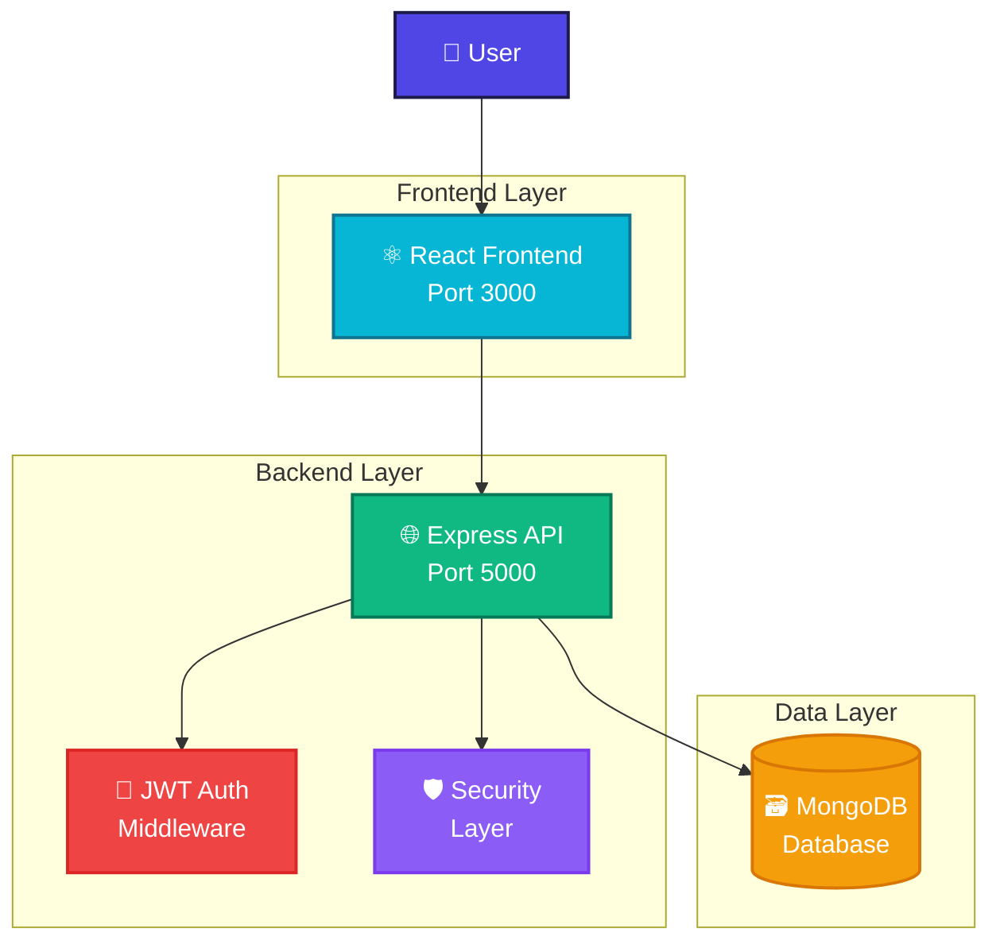
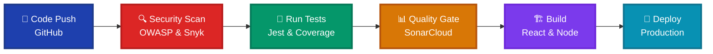

<div align="center">

# 💰 PayFlow - Secure International Payment Portal


**Enterprise-Grade Security** • **MERN Stack** • **Academic Excellence**

</div>

---

## 🎯 Project Overview

PayFlow is a comprehensive secure payment portal designed for international transactions with enterprise-grade security features. This project demonstrates advanced cybersecurity principles including secure authentication, input validation, CSRF protection, and comprehensive security testing.

**Course:** INSY7314 - Information Systems Security  
**Institution:** Varsity College (ADvTECH Group)  
**Year:** 2025

### Tech Stack


---

## 👥 Team Members

- **Jayden Larkins**  
- **Gerhard Lemmer**   
- **Thatho Mokoena**  
- **Mokran Ait Amara**

---

## ✨ Key Features

### 🔐 Security Features
- Multi-layer authentication with JWT tokens
- CSRF and XSS protection
- Rate limiting and request monitoring
- HTTPS enforcement with SSL certificates
- Input validation and sanitization

### ⚡ Technical Features  
- Real-time payment processing
- Employee and customer portals
- Comprehensive test coverage (95%+)
- Automated CI/CD pipeline
- SonarCloud integration for code quality

### 🌍 Business Features
- International payment support
- Multi-currency transactions
- SWIFT integration
- Payment verification system
- Transaction history and reporting

---

## 🏗️ System Architecture

### System Overview


### Backend Structure
```
backend/
├── auth/              # Authentication & middleware
├── controller/        # API route controllers  
├── middleware/        # Security layers
├── service/          # Business logic
├── database/         # MongoDB configuration
├── utils/            # Validation utilities
├── tests/            # Comprehensive testing
└── server.js         # Application entry point
```

### Frontend Structure
```
frontend/
├── src/
│   ├── components/    # React components
│   ├── lib/          # Axios configuration
│   ├── utils/        # Helper utilities
│   └── App.jsx       # Main application
├── public/           # Static assets
└── package.json      # Dependencies
```---

## 🔒 Enterprise Security Framework


### 🔐 Authentication & Authorization
- 🎫 **JWT Tokens** with HTTP-Only cookies
- 👥 **Role-based Access** (Employee vs Customer)
- 🔄 **Session Management** with secure settings
- 🔒 **Password Hashing** using bcrypt (12 rounds)
- ⏰ **Token Expiration** & refresh mechanisms

### 🛡️ Input Security
- ✅ **RegEx Whitelist** validation for all inputs
- 🚫 **XSS Protection** with input sanitization
- 💉 **SQL Injection Prevention**
- 📝 **Zod Schema** validation on frontend
- 🔍 **Data Validation** at multiple layers

### 🌐 Network Security
- 🛡️ **CSRF Protection** with token validation
- ⏱️ **Rate Limiting** (15 requests/15 minutes)
- 🌍 **CORS Configuration** with whitelist
- 🪖 **Helmet.js** security headers
- 🔐 **HTTPS Enforcement** with SSL certificates

### 🏗️ Infrastructure Security
- 📋 **Content Security Policy** (CSP)
- 🔒 **Strict Transport Security** (HSTS)
- 🔧 **Security Headers** configuration
- 🌿 **Environment Variables** protection
- 🔄 **Secure Cookie** settings

### Security Standards Compliance


---

## 📡 API Documentation

### Authentication Endpoints
```http
POST /auth/register    # User registration
POST /auth/login      # User authentication
POST /auth/logout     # Secure logout
GET  /auth/verify     # Token verification
```

### Payment Management
```http
GET  /api/payments         # Retrieve user payments
POST /api/payments         # Create new payment
GET  /api/payments/:id     # Get specific payment
PUT  /api/payments/:id     # Update payment status
```

### Employee Portal
```http
GET /api/employee/payments           # View all payments (admin)
PUT /api/employee/payments/:id/verify # Verify payment
GET /api/employee/dashboard          # Employee dashboard data
```---

## 🚀 Quick Start

### Prerequisites
- **Node.js** v18 or higher
- **MongoDB** (local or cloud instance)
- **Git** for version control

### Installation

1. **Clone the repository**
```bash
git clone https://github.com/ST10255814/insy7314-final-poe.git
cd insy7314-final-poe
```

2. **Setup Backend**
```bash
cd backend
npm install
# Configure environment variables
cp .env.example .env
```

3. **Setup Frontend**
```bash
cd ../frontend
npm install
```

4. **Start Development Servers**

**Backend (Terminal 1):**
```bash
cd backend
npm run dev
# Server runs on https://localhost:5000
```

**Frontend (Terminal 2):**
```bash
cd frontend
npm start
# Application runs on https://localhost:3000
```

### Default Login Credentials
- **Employee Username:** `bank_employee`
- **Employee Password:** `Employee@123`### 🌐 **Browser Setup for Development**
<details>
<summary>Click to expand browser configuration for self-signed certificates</summary>

**Windows:**
```bash
chrome.exe --ignore-certificate-errors --user-data-dir="C:/temp/chrome_dev" --disable-web-security
```

**macOS:**
```bash
open -a "Google Chrome" --args --ignore-certificate-errors --user-data-dir="/tmp/chrome_dev" --disable-web-security
```
</details>

---

## 🧪 Testing & Quality Assurance


### 🔧 Backend Testing
```bash
cd backend
npm test                 # 🧪 Run all tests
npm run test:watch       # 👀 Watch mode
npm run test:ci          # 🔄 CI with coverage
npm run test:security    # 🛡️ Security tests
```

**Test Coverage:**
- ✅ Unit Tests: Authentication, Controllers
- ✅ Integration Tests: API endpoints
- ✅ Security Tests: OWASP validations
- ✅ Performance Tests: Load testing

### 🔐 Security Testing
```bash
npm run security:audit   # 📊 NPM audit
npm run security:snyk    # 🔍 Snyk scan
npm run security:zap     # ⚡ OWASP ZAP
npm run lint:security    # 🛡️ ESLint rules
```

**Security Scans:**
- ✅ Dependency vulnerabilities
- ✅ Static code analysis
- ✅ Dynamic security testing
- ✅ Penetration testing automation

---

## 🔄 CI/CD Pipeline


### 🚀 **Pipeline Stages**



### 🔄 Workflow 1: Comprehensive CI/CD
- 🔐 **Security Scanning**: OWASP, Snyk
- 🧪 **Testing Suite**: Unit, Integration, E2E
- 🏗️ **Build Process**: Frontend & Backend
- 📊 **Quality Analysis**: SonarCloud integration
- 🚀 **Deployment**: Automated staging/production

### 🛡️ Workflow 2: Security-First
- 🔍 **SAST**: Static Application Security Testing
- 📦 **Dependency Check**: Automated vulnerability scanning
- 🔒 **License Compliance**: Legal compliance monitoring
- 📋 **Security Reports**: Comprehensive vulnerability reports

---

## 🛠️ Development Commands

### 🔧 Backend Commands
```bash
npm start              # 🚀 Production server
npm run dev            # 🔧 Development mode
npm test               # 🧪 Run test suite
npm run lint           # 📝 Code linting
npm run lint:fix       # 🔧 Auto-fix issues
npm run security:audit # 🔐 Security audit
```

### ⚛️ Frontend Commands
```bash
npm start              # 🔧 Development server
npm run build          # 🏗️ Production build
npm test               # 🧪 Run tests
npm run lint           # 📝 Code linting
npm run lint:fix       # 🔧 Auto-fix issues
npm run analyze        # 📊 Bundle analysis
```

---

## 🔐 Security & Compliance


### 📋 Standards Compliance
- 🛡️ **OWASP Top 10** protection measures
- 💳 **PCI DSS** considerations for payments
- 🔒 **GDPR** data protection principles
- 📊 **ISO 27001** security management
- 🔐 **SOC 2** compliance framework

### 🧪 Security Testing
- 🎯 **Penetration Testing**: Manual & automated
- 🔍 **Vulnerability Scanning**: OWASP ZAP
- 📊 **Code Analysis**: Static analysis with SonarCloud
- 📦 **Dependency Auditing**: Continuous monitoring
- 🔄 **Regular Security Reviews**

---

## 🎥 Demo Videos

### 🔧 Backend API Walkthrough
[](https://youtu.be/1fQPPgvUX4Q)

**Covers:**
- API endpoints demonstration
- Security features showcase
- Database interactions
- Authentication flow

### 💳 Frontend Payment Gateway
[](https://youtu.be/DrvEL8eiAYk)

**Highlights:**
- User interface walkthrough
- Payment flow demonstration
- Security features in action
- Responsive design showcase

---

## 📄 License

This project is developed for educational purposes as part of the INSY7314 course curriculum.

**⚠️ Academic Use Only**: This project is intended for educational purposes and should not be used in production environments without proper security review and hardening.

---


*Last Updated: November 2025*